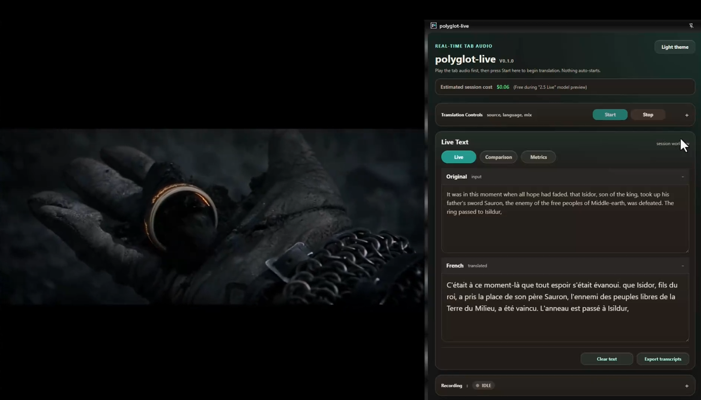

# polyglot-live

## Demo

[](https://youtu.be/X8DJ7oLaCfU)

[Watch the demo video on YouTube](https://youtu.be/X8DJ7oLaCfU)

`polyglot-live` is a Chrome Manifest V3 extension for real-time tab-audio translation suitable for live tranlation of any audio in a briwser tab:

- a side panel for controls and live status
- a readiness check that verifies local token provisioning before live start
- a right-click context menu entry for opening the side panel on the current page
- a service worker for orchestration
- an offscreen document for audio capture and playback
- a real Gemini Live Translate WebSocket client
- a local ephemeral-token server powered by Google's official `@google/genai` SDK

## For testers

This build is meant for hands-on local testing of live translation workflows in Chrome.

You should use this repo if you want to test:

- live translation from browser tab audio
- live translation from microphone input
- transcript review in the side panel
- browser-native back-translation comparison
- local-AI post-session translation scoring
- replay capture and export

You should not expect:

- one-click consumer install from the Chrome Web Store
- cloud-hosted token provisioning
- perfect speaker-voice preservation
- guaranteed support on Chrome internal pages such as `chrome://`

## Current status

This repo now includes a real Live Translate WebSocket transport and a working local token provisioning server. It is ready for local tester installs, but each tester still needs to run the token server locally and provide a Gemini API key through environment variables.

The current build matches the documented Gemini Live Translate contract more closely and is working as a local developer build:

- product name: `Gemini 3.5 Live Translate`
- model: `gemini-3.5-live-translate-preview`
- input audio: raw 16-bit PCM, 16kHz, mono, little-endian
- output audio: raw 16-bit PCM, 24kHz, mono, little-endian
- send cadence: 100ms audio chunks
- translation target is selectable in the side panel and persists across sessions
- ephemeral tokens must use the `v1alpha` constrained WebSocket endpoint

Current UI capabilities:

- manual start only: nothing auto-starts
- `Input source` supports both `Tab audio` and `Microphone`
- `Start` begins translated-only audio playback
- target language is selected from a sticky dropdown and restored on reload
- the dropdown is populated from the current Gemini Live Translate supported-language list
- the panel includes `Live`, `Comparison`, and `Metrics` workflow tabs
- `Original` and translated live text panes are collapsible
- both text panes are stacked vertically, full width, and resizable
- live text panes show dialogue-only transcript content
- replay recording can be previewed and exported as MP3
- demo mode can start a random language for a short sample run
- target language can be changed during an active session and the extension will restart the live session for the new language
- translated voice rendering should be treated as best-effort, especially for multi-speaker audio

## Tester quick start

If you are handing this repo to a tester, this is the shortest working path:

1. Install Node.js.
2. Open PowerShell in the repo root and run `npm install`.
3. Set `GEMINI_API_KEY` and start `node .\server\token-server.mjs`.
4. Load the folder as an unpacked extension in `chrome://extensions`.
5. Open the side panel.
6. In `Auth`, confirm `http://127.0.0.1:8787/token`, enter the same shared secret if you used one, and click `Check readiness`.
7. Choose `Tab audio` or `Microphone`.
8. Choose a target language.
9. Press `Start`.

## What testers should verify

- tab audio translation starts on normal web pages with playable audio
- microphone translation starts after microphone permission is granted
- translated audio plays back in the selected target language
- live transcript panes populate during the session
- changing the target language during a live session switches the session cleanly
- comparison tab generates browser-native back-translation after a session
- metrics tab generates local-AI scoring after comparison is available
- replay recording can be started, stopped, previewed, and exported
- theme, language, and other sticky settings survive reloads

## Screenshot tour

When the extension is working properly, testers should expect these main UI areas:

1. `Translation Controls`
   Use this section to choose `Tab audio` or `Microphone`, select the target language, adjust original audio mix, and start or stop the live session.

2. `Live Text`
   This is the main workflow area. The `Live` tab shows original and translated transcript panes. The `Comparison` tab is for browser-native back-translation review. The `Metrics` tab is for local-AI scoring after the session.

3. `Utilities`
   This area holds support items like `Auth`, `Audio Alignment`, and `Status`, so testers can confirm the token server is reachable and inspect session state when troubleshooting.

4. `Recording`
   This section supports replay capture, replay preview, and MP3 export for translated audio.

If you are packaging this for testers, adding 2 to 4 screenshots to the repo or release notes is recommended:

- the side panel at first launch
- the `Auth` readiness success state
- a live translation session with transcript text visible
- a completed `Comparison` or `Metrics` review state

## Architecture

1. The user opens the side panel on a source tab.
2. The side panel asks the service worker to start a capture session.
3. The service worker creates the offscreen document if needed and requests a tab stream id.
4. The offscreen document converts the captured tab audio into 16kHz PCM chunks and streams them to Gemini Live Translate over WebSocket.
5. The token server provisions short-lived ephemeral tokens from your long-lived Gemini API key.
6. Translated 24kHz PCM audio is played back from the offscreen document and status messages are relayed back to the side panel.

## Files

- `manifest.json`: MV3 config, permissions, side panel, and offscreen setup
- `config.js`: shared model, audio, and endpoint constants
- `background.js`: service worker orchestration
- `sidepanel.html`, `sidepanel.css`, `sidepanel.js`: control surface
- `offscreen.html`, `offscreen.js`: hidden audio pipeline host and Gemini WebSocket client
- `server/token-server.mjs`: local ephemeral-token provisioning server using `@google/genai`
- `package.json`: local Node package metadata and SDK dependency

## Prerequisites

Before using the extension, make sure you have:

1. Chrome with Developer mode available in `chrome://extensions`
2. Node.js installed locally
3. A Gemini API key from Google AI Studio
4. The project dependency installed from the repo root:

```powershell
cd <repo-root>
npm install
```

If you already ran setup in this folder, `@google/genai` should already be present under `node_modules`.

## Create a Gemini API key

To create a Gemini API key for local testing:

1. Go to Google AI Studio and sign in with your Google account.
2. If prompted, accept the current terms of service.
3. Open the API key flow from the official AI Studio `Get API key` entry point.
4. Create a key in the default project AI Studio gives you, or choose/import an existing Google Cloud project.
5. Copy the key immediately and store it safely.
6. Use that key only in your local token-server shell session through `GEMINI_API_KEY`.

Important notes:

- as of June 23, 2026, Google documents a free tier for Gemini API usage and lists `gemini-3.5-live-translate-preview` as free on that tier
- new AI Studio keys are now created as authorization keys by default
- every Gemini key is still tied to a Google Cloud project, even when created through AI Studio
- testers should watch the official pricing page because preview pricing can change
- you should treat the key as sensitive even when using the free tier

## Local auth setup

Open PowerShell in the repo root:

```powershell
cd <repo-root>
```

## Start the local token server

Use this exact startup sequence in PowerShell:

```powershell
cd <repo-root>
$env:GEMINI_API_KEY="your-real-gemini-api-key"
$env:POLYGLOT_LIVE_SHARED_SECRET="your-local-secret"
node .\server\token-server.mjs
```

Expected server output:

```text
polyglot-live token server listening at http://127.0.0.1:8787/token
polyglot-live readiness probe available at http://127.0.0.1:8787/status
```

Then use these same values in the side panel:

- `Token endpoint`: `http://127.0.0.1:8787/token`
- `Shared secret`: the exact same value you used in `POLYGLOT_LIVE_SHARED_SECRET`

Notes:

- `GEMINI_API_KEY` is your real Google AI Studio API key
- `POLYGLOT_LIVE_SHARED_SECRET` is just a local secret you choose yourself
- the shared secret is not registered with Gemini; it only protects your local token server

## API key safety

Use your Gemini API key only on the local token server side.

Pricing note:

- as of June 23, 2026, Google's official Gemini API pricing page lists `gemini-3.5-live-translate-preview` as `Free of charge` on the free tier
- this can change when Google moves the preview model to a paid phase or replaces it with a production model
- testers should keep an eye on the official Gemini pricing page before assuming live translation remains free
- even during free preview, users should still protect their API key as if it were a paid credential

Safe practices for this repo:

- do keep `GEMINI_API_KEY` in an environment variable
- do keep the key out of `README.md`, source files, screenshots, and chat messages
- do keep the key out of the Chrome side panel; the extension should talk only to your local token server
- do keep `node_modules/` and other local-only files out of git; `.gitignore` already excludes them
- do rotate the key in Google AI Studio if you think it was pasted somewhere unsafe
- do use a temporary PowerShell session variable when possible

Do not:

- do not hard-code the key in `background.js`, `offscreen.js`, `config.js`, or any extension file
- do not commit the key to git, even in a private repo
- do not store the real key in Chrome extension storage
- do not share the real key in screenshots or copied terminal history

Recommended local pattern for a single PowerShell session:

```powershell
$env:GEMINI_API_KEY="your-real-gemini-api-key"
$env:POLYGLOT_LIVE_SHARED_SECRET="optional-local-secret"
node .\server\token-server.mjs
```

That keeps the key in the current shell session only. Closing that shell drops the value.

If you want a persistent Windows environment variable, use `setx`, but treat that as less private because it stays on the machine after the shell closes:

```powershell
setx GEMINI_API_KEY "your-real-gemini-api-key"
```

After using `setx`, open a new PowerShell window before starting the token server.

Then set your environment variables before starting the token server:

```powershell
$env:GEMINI_API_KEY="your-real-gemini-api-key"
$env:POLYGLOT_LIVE_SHARED_SECRET="optional-local-secret"
node .\server\token-server.mjs
```

If you want a fast local test, you can skip the shared secret and run:

```powershell
cd <repo-root>
$env:GEMINI_API_KEY="your-real-gemini-api-key"
node .\server\token-server.mjs
```

The side panel defaults to `http://127.0.0.1:8787/token`. The shared secret is something you choose locally; it is not registered with Gemini.

When the server starts successfully, it should print:

```text
polyglot-live token server listening at http://127.0.0.1:8787/token
polyglot-live readiness probe available at http://127.0.0.1:8787/status
```

## Load in Chrome

1. Open `chrome://extensions`.
2. Enable Developer mode.
3. Click Load unpacked.
4. Select this repo checkout folder.
5. Open the side panel.
6. Leave the token endpoint as `http://127.0.0.1:8787/token` unless you changed the server host or port.
7. If you set `POLYGLOT_LIVE_SHARED_SECRET`, enter that exact same value in the side panel's shared secret field.

Important tab-capture limits:

- tab audio capture does not work on `chrome://` pages
- tab audio capture does not work on the Chrome Web Store
- tab audio capture does not work on other browser-internal pages

## Readiness check

Before pressing `Start`, click `Check readiness` in the `Auth` card.

If everything is healthy, you should see:

- `Ready: local token server reachable and Gemini token accepted.`
- the main status badge move to `READY`

If it fails, the panel should tell you whether the issue is:

- the local token server is not running
- the shared secret does not match
- Gemini token provisioning failed

The readiness check verifies the same token path that the offscreen Live session uses.

## Start translation

Important current behavior:

- the side panel does not auto-start translation
- the right-click menu opens the side panel but does not start translation
- `Tab audio` and `Microphone` are both supported input sources
- the side panel remembers the last selected target language
- the extension currently plays translated audio only
- a microphone permission grant is not the same as translation-ready; the live session is only ready once the panel shows the ready/live state for the active session
- if you change target language during an active session, the extension restarts the live session for the new language
- `Stop` shuts down the current offscreen Gemini session before restart

Recommended flow:

1. Start the local token server
2. Reload the unpacked extension
3. Open the side panel
4. Click `Check readiness`
5. Choose `Tab audio` or `Microphone`
6. If using microphone mode, grant microphone access first
7. If using tab mode, start the source audio on a normal website tab
8. Press `Start` only after the panel reports readiness
9. Wait for the live session ready indicator before judging translation startup timing

The token server validates the selected language against the shared supported-language list before provisioning the ephemeral token.

## Comparison and metrics workflow

After a translation session:

1. Open the `Comparison` tab to generate a browser-native back-translation of the translated transcript.
2. Review the original transcript and back-translation together.
3. Open the `Metrics` tab to generate local-AI scoring and reviewer notes.

Current behavior notes:

- comparison and metrics are intended as post-session review tools
- metrics depend on comparison output being available first
- comparison and metrics results stay visible until you manually clear text or start a fresh session

## Replay recording

The `Recording` section supports:

- start recording during a live translation session
- stop recording and keep the captured replay
- replay the captured translated audio locally
- export the replay as MP3

Recording is tied to the active session tab. Start translation first, then use the recording controls on that same tab session.

## Known limitations

- translated voice identity is best-effort and may not reliably preserve speaker gender or speaker changes
- tab audio capture is limited by Chrome page restrictions
- browser-native comparison depends on Chrome built-in AI availability and supported language pairs
- metrics depend on Chrome local AI availability on the tester's device
- this is still a local test build, so the token server must run on the tester's machine

## Voice behavior limits

Gemini Live Translate currently handles translated voices on a best-effort basis.

Important current limits from the Google documentation:

- voice replication can shift after long pauses
- the model can assign the wrong gender based on how speech begins
- rapid multi-speaker conversations can collapse onto a single translated voice

So while a male/female two-speaker source may sometimes sound distinct in the translated output, this should not be treated as a guaranteed feature of the current Live Translate pipeline.

## Debugging

Useful places to look while testing:

- Side panel console: inspect the side panel window
- Extension service worker console: open it from `chrome://extensions`
- Token server console: the PowerShell window running `node .\server\token-server.mjs`

Current background logs include messages such as:

- `[polyglot-live/background] installed`
- `[polyglot-live/background] rebuilding context menu`
- `[polyglot-live/background] preparing translation session`
- `[polyglot-live/background] tab capture stream acquired`
- `[polyglot-live/background] stop requested`

Current offscreen logs include messages such as:

- `[polyglot-live/offscreen] requesting ephemeral token`
- `[polyglot-live/offscreen] ephemeral token accepted`
- `[polyglot-live/offscreen] websocket open`
- `[polyglot-live/offscreen] setup complete`
- translated audio packet receipts and active session close messages

## Next build steps

1. Improve approximate translated-word timing so the highlight tracks speech more naturally.
2. Add richer reconnect and session-resumption handling around `goAway` and websocket churn.
3. Consider a searchable language picker now that the dropdown includes the full supported list.
4. Move the shared-secret check to a stronger user auth scheme if this leaves local-only development.
5. Add packaging, logging controls, and extension options UX.
